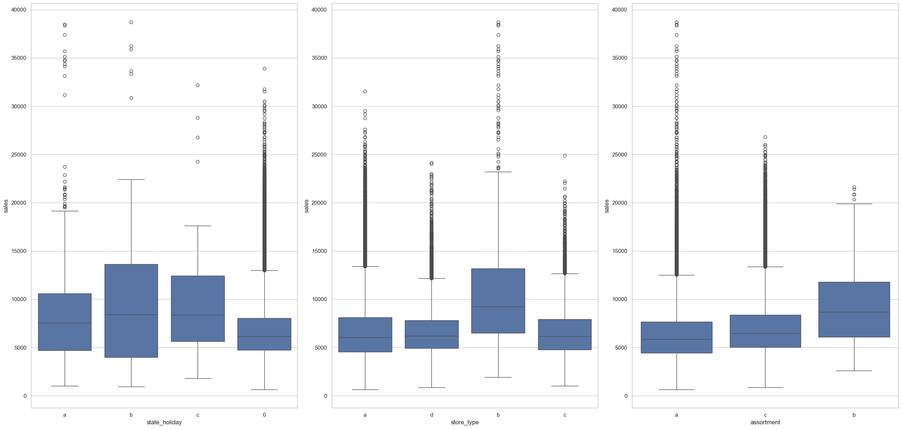
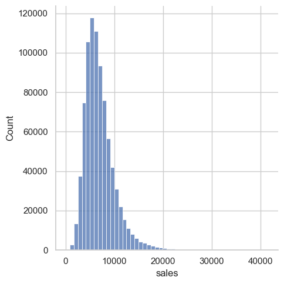
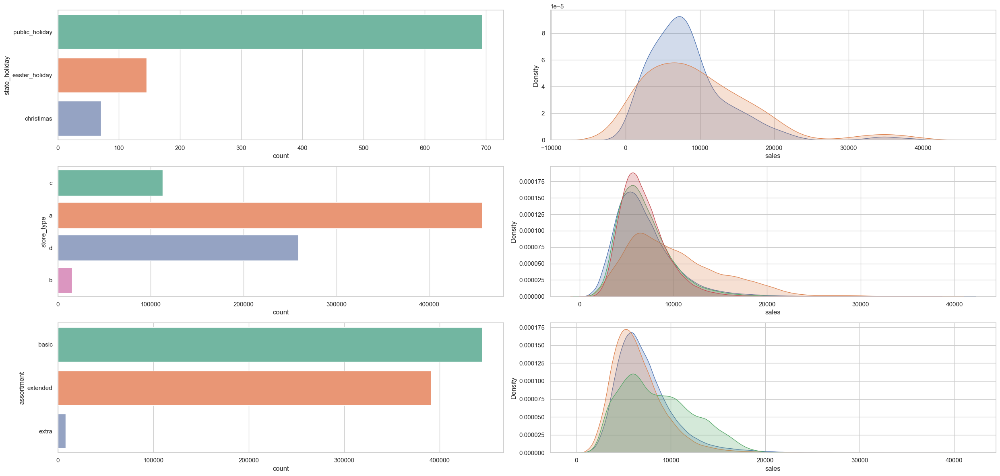
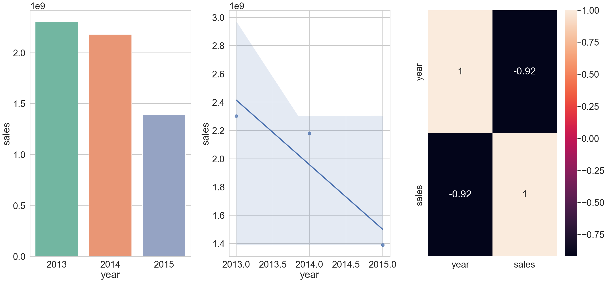
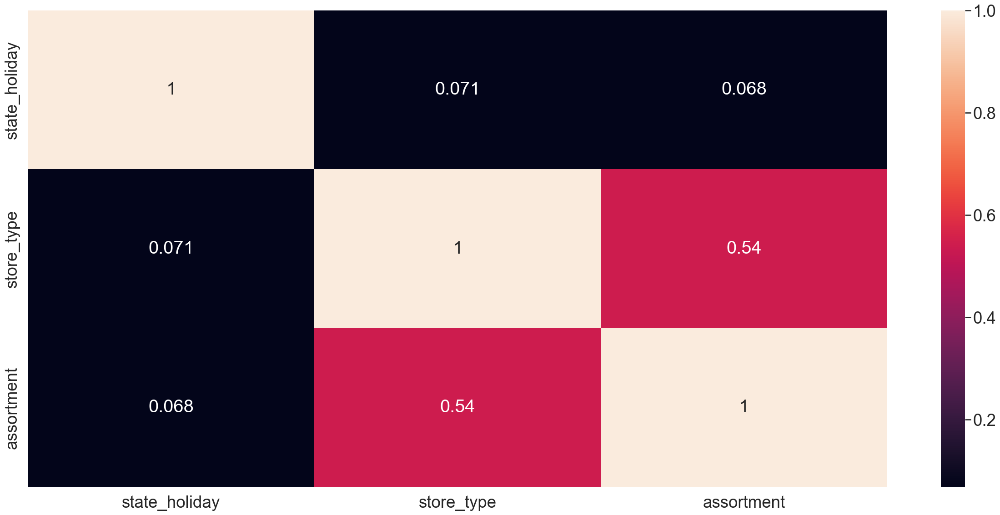
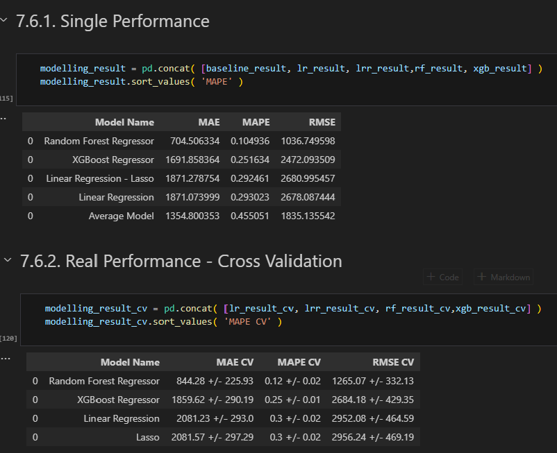
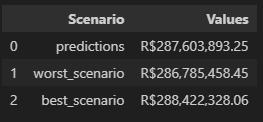
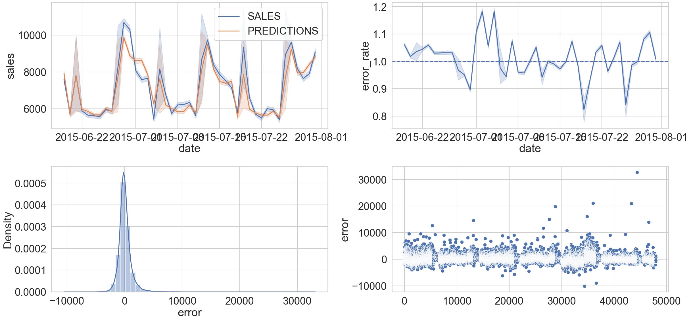
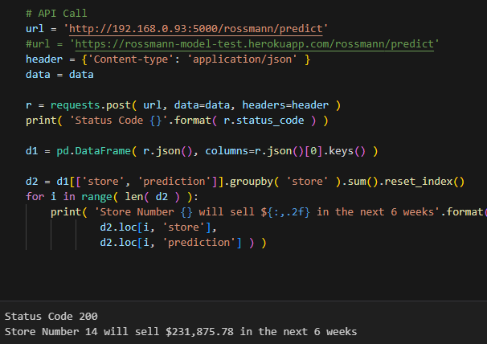

# Rossmann Sales Forecast 

  

## Business Problem 
### Scenario
Rossmann operates over 3,000 drug stores in 7 European countries. Currently, Rossmann store managers are tasked with predicting their daily sales for up to six weeks in advance. Store sales are influenced by many factors, including promotions, competition, school and state holidays, seasonality, and locality. With thousands of individual managers predicting sales based on their unique circumstances, the accuracy of results can be quite varied.

**Rossmann is challenging you to predict 6 weeks of daily sales for 1,115 stores located across Germany** . Reliable sales forecasts enable store managers to create effective staff schedules that increase productivity and motivation. By helping Rossmann create a robust prediction model, you will help store managers stay focused on what’s most important to them: their customers and their teams!

### Overview
The data used in this project can be found at this [Kaggle](https://www.kaggle.com/competitions/rossmann-store-sales/data) link.

You are provided with historical sales data for 1,115 Rossmann stores. The task is to forecast the "Sales" column for the test set. Note that some stores in the dataset were temporarily closed for refurbishment.

### Data Fields

- **Id** - an Id that represents a (Store, Date) duple within the test set
- **Store** - a unique Id for each store
- **Sales** - the turnover for any given day (this is what you are predicting)
- **Customers** - the number of customers on a given day
- **Open** - an indicator for whether the store was open: 0 = closed, 1 = open
- **StateHoliday** - indicates a state holiday. Normally all stores, with few exceptions, are closed on state holidays. Note that all schools are closed on public holidays and weekends. a = public holiday, b = Easter holiday, c = Christmas, 0 = None
- **SchoolHoliday** - indicates if the (Store, Date) was affected by the closure of public schools
- **StoreType** - differentiates between 4 different store models: a, b, c, d
- **Assortment** - describes an assortment level: a = basic, b = extra, c = extended
- **CompetitionDistance** - distance in meters to the nearest competitor store
- **CompetitionOpenSince[Month/Year]** - gives the approximate year and month of the time the nearest competitor was opened
- **Promo** - indicates whether a store is running a promo on that day
- **Promo2** - Promo2 is a continuing and consecutive promotion for some stores: 0 = store is not participating, 1 = store is participating
- **Promo2Since[Year/Week]** - describes the year and calendar week when the store started participating in Promo2
- **PromoInterval** - describes the consecutive intervals Promo2 is started, naming the months the promotion is started anew. E.g. "Feb,May,Aug,Nov" means each round starts in February, May, August, November of any given year for that store

## Solution Planning 

### CRISP-DS
To develop this project, we used **CRISP-DS**, a cyclical methodology for developing data science projects. The idea is to complete the project by understanding the business problem and then, after the results, go back to the beginning and try to improve the development even further. The image below shows the steps that was used to finish this project. 

  

## Project Stages

### Data Description
This is where I first take a look at the data, seeing its dimensions, the data types and checking for null and duplicate data. In addition, I also fill in the null data and change the data types. Finally, I did a simple descriptive statistics analysis to see the general distribution of the attributes. 

### Feature Engineering
Here, hypotheses were created from the data attributes and, based on these hypotheses, the variables that would be useful for validating (or not) the hypotheses were created. 

### Exploratory Data Analysis (EDA)
Univariate, bivariate and multivariate analyses were carried out. To do this, graphs were constructed to help understand the behavior of the variables. 

In the univariate analysis, we looked at the behavior of the “sales” response variable. And the other variables in the dataset. 

In the bivariate analysis, the hypotheses constructed in the previous phase were put to the test. All of them were tested and verified. 

Finally, in the multivariate analysis, correlation heat maps were used using pearson for numerical variables and cramer v for categorical variables. 

### Data Preparation
Here we've made some changes to the variables to apply the machine learning models. Rescaling, Encoding, and Nature Transformation for example. 

### Feature Selection
Here we used the Boruta algorithm to choose the best features for the models, and we also took into account the impact of the variables seen during the EDA to actually select them. 

### Machine Learning Modeling
A number of models were applied and the performance of each was measured to see which were the best. The models chosen were Average Model, Linear Regression, Linear Regression Regularized, Random Forest Regressor, XGBoost Regressor and all the alternatives were also applied using cross validation. 

The metrics used to evaluate them were MAE, MAPE and RMSE. Below you can see the models and their respective metrics. The model chosen for the next steps was the Random Forest Regressor.

### Hyperparameter Fine Tunning 
RandomizedSearchCV was used to find the best Random Forest parameters. 

### Translation and Interpretation of Error 
For better understanding by the business team, the ML metrics were translated into business performance.

### Model Deploy to Production 
Finally, a Python class and an API Handler were built using Flask. This way, you can directly access the model's results by passing the store as a parameter. You can then check the forecast for the next 6 weeks of sales for each store. 

## Conclusion

